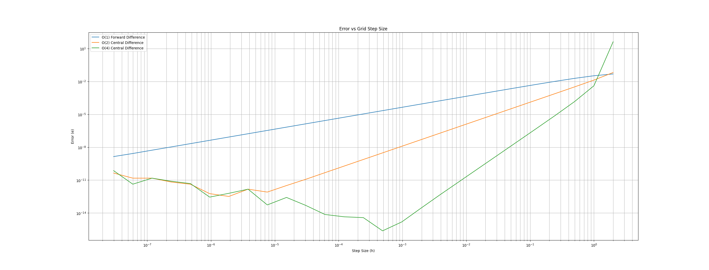

# Numeric Derivative Approximations

## Motivation

In the world of mathematics we use the derivative to describe the "rate" at which the value of a given function $F(x)$, changes over some range of input values. The derivative of $F(x)$ can be shown with several different notations. Some common shorthand notations are:

$$\dot{F}(x) =  F^{'}(x) = \frac {dF(x)}{dx} = \frac{\partial F(x)}{\partial x}$$

In a purely mathematical inspection of the derivative of our function $F(x)$ we might choose to take a global look at the function's behavior over all values of $x$ such that our range is the inclusive range $(-\infty, \infty)$. By inspecting the behavior of the derivative in this way we might discover if our function $F(x)$ has minimum or maximum values or maybe discontinuities over certain regions of $x$. Deeper exploration of the properties of derivatives and how we can use them to characterize functions will be better motivated in a section specifically on derivatives. So we will proceed with the understanding that the reader is already familiar with derivatives and their applications.

While derivatives have some nice properties for understanding the characteristics of our function $F(x)$ in a purely mathematical context. The real world often gets in the way when we attempt to apply our mathematical tool belt to a sufficiently complex problems. For example, we have assumed a few things that may not hold true in the 'real' world!

**Naive Assumptions:**

1. **The function $F(x)$ is known to us.** It could well be the case that we don't have an 'Analytic' definition of the function and in fact have to estimate it by using mathematical techniques to 'fit' the data and work backwards into an approximate function. Techniques to do so are not covered here.

2. **The function $F(x)$ is differentiable.** Depending on the function in question, it may have a function that does not exist for all of $(-\infty, \infty)$. The function might only have a derivative that exists over some specified sub range of $x$.

3. **We are able to determine the exact derivative of $F(x)$ using mathematical techniques.** While mathematics offers us many powerful techniques for finding the exact derivatives of functions analytically (AKA the "right" answer); as the complexity of our functions increase, it is not uncommon for an analytical solution to become impossible to achieve. Particularly in systems of non-linear multivariate functions we have an increase chance of our functions becoming too complex to solve using conventional mathematical methods.

## Approximating the Derivative

So then what are we to do if we wish to find the derivative of a function, but we either can not or wish not to find an analytic solution that is valid for the values of $x$ that we are interested in?

Luckily a technique exists to help us if we encounter such a situation and all it requires is a shift in our approach to the problem. Lets assume that instead of trying to find the exact values of $\dot{F}(x)$, rather we would be satisfied if we could estimate the value to a reasonable degree of accuracy. Could we find such an approximation of $\dot{F}(x)$ such that it approaches the true value of $\dot{F}(x)$?

 To answer this question we must examine the following thought experiment. Suppose I computed the value of $F(x)$ and then computed the value of $F(x+h)$ where $h$ is some small amount that we added to our function input. We could say that we have *"perturbed"* the input to the function $F(x)$ and in doing so we have obtained two output values for our function.

 Now we could imagine that if we perturbed the value of $F(x)$ by a large amount then we would expect vastly different values of $F(x)$ and $F(x+h)$. With only two data points that are very far apart due to a large change in our inputs, I would propose to you that we don't have a good estimate of the derivative. One flaw in our approach is if we have to points in our function space that are very far apart, then function output behavior could change vastly between those two points. We might attempt to mitigate this flaw for points that are far apart by taking an average of the changes between the two points.

 $$\dot{F}(x) = \frac{F(x+h)-F(x)}{h}$$

 This however this may prove not very accurate as we are attempting to approximate the derivative at two points of $x$ that are very far apart. What happens then, if we simply limit ourselves to small values of $h$? Surely if we only *"perturb"* our function a little bit then the average of the two values of $F(x)$ will be much closer and we will obtain a much better estimate of the local change between the two points?

 This is actually the exact leap we are looking to make in this article. By now the reader may have noticed that we can apply several more techniques to improve our estimation of the derivative at a small local region of our function. For example what if we extend our approach one step further by using a 2nd Order O(2) or higher O(n) method of measuring the perturbation of the function $F(x)$? [^1]

  In fact in the rest of this page we will review the results of a brief experiment that will address some of these questions. The exercise will examine how close our approximations get to the "true" value of a derivative function for various sizes of $h$. We will also explore some higher order approximations of the derivative to see if including more numerical terms increases our accuracy.

## Exercise: Examine the Accuracy of Various Numeric Derivative Strategies

 There is far more reading to be done on the topic of accurately modeling a numeric derivatives, but hopefully by now we can begin to see the motivation for such an approach. As a side note the higher order derivative approximations used in this example are well explored in academic literature. Take some time to examine the graph below.

[^2]

In the graph above there are several notable regions that we should examine.

First we should note that for each approach there are regions where the Errors are `linear`. This is important because it validates our models are achieving the expected accuracy based on the order O(n) of the method used to approximate the derivative and we achieve a good approximation in those regions. Regions of the graph that are `non-linear` need to be understood too.

Within the region of step sizes $10^{-7}$ to $10^{-3}$ for the 4th Order Central Difference and in $10^{-7}$ to $10^{-5}$ for the 2nd Order Central Difference method we can observe that the error values are no longer `linear`. Rather they are noisy and there is an inflection in the trend lines.

Both the 2nd order and 4th order central difference curve are exhibiting truncation error within those regions. Within these regions the step size $h$ is too small. Thus round off and truncation errors start to have a magnitude much larger than the error value and we cannot distinguish the true error value anymore. It should be noted that while the 1st Order Forward Difference curve does not show any growth in error at the lower bound of our graph $10^{-7}$, the curve will eventually begin to increase in error.

Mathematically as the step size $h$ approaches the machine epsilon, the computer will no longer be able to numerically represent the number.  Because the 2nd and 4th Order Difference equations have a higher order, they approach machine epsilon much faster than the 1st Order Forward Difference equation.

Machine epsilon is the smallest change in values a program can represent and is related to the number of bits in the number. Investigate 32 bit vs 64 bit floating point numbers to understand this better.

Within the region $10^{-1}$ to $10^{1}$ we can see what happens when the step size $h$ becomes too large. Here all three curves exhibit a deviation from the `linear` trend. While the 1st and 2nd Order Difference curves have small deviations from the trend, the 4th Order curve shows a large deviation. In this case the higher order of the terms in the 4th Order approximation can create problems when round-off and truncations errors become too large. At this upper bound the dominant error is the round off error. When step size $h$ gets too large then there is simply too much round off error for the approximation to be accurate. The higher order terms in the 4th Order method especially amplify these errors.

[^1]: maybe this would be a good place to put some examples of how higher order approximations are derived. e.g. taylor series and PADE scheme.

[^2]: I should have an updated chart that has some colored boxes to overlay over the chart to highlight the areas im talking about
